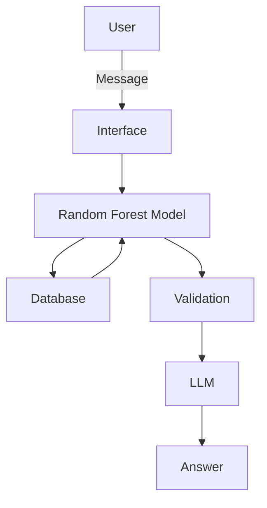

# Financial Risk Analysis Agent

An intelligent agent designed to act as a virtual credit analyst. Using artificial intelligence and data analysis, the agent assesses the profile of clients (individuals or companies) and predicts the likelihood of default based on financial metrics.

## Context

The context of virtual financial assistants in Brazil is marked by an accelerated transition from reactive chatbots (simple attendants) to generative intelligent agents (financial co-pilots). With over 200,000 active virtual assistants in the country, the financial sector leads the adoption of Artificial Intelligence (AI) for automation and personalization.

- **Generative AI as a Financial Co-pilot:** More than 50% of Brazilian banks use AI, migrating from basic services to complex analyses, fraud prevention, and personalized service. These agents anticipate needs instead of just reacting to commands.

- **Fintech Assistants:** The Brazilian fintech market has grown 77% since 2020, reaching more than 2,000 companies in 2025, many using bots on WhatsApp for personal and small business finance management.

- **Hyperpersonalization:** AI analyzes data to offer personalized insights, automatic expense categorization, and financial product recommendations, essential in a scenario where 55% of Brazilians admit to low levels of financial literacy.

- **Security and Trust:** It is essential that these systems can work around metrics that reinforce the accuracy and reliability of the model, avoiding cases of hallucination.

## Features

* **Profile Collection:** User interaction to collect essential data (Credit Score, Sector, Leverage, etc.).

* **Risk Prediction:** Calculation of the probability of default using a Machine Learning model trained with historical data.

* **Expected Loss Calculation:** Estimation of the financial value at risk if the client becomes delinquent.

* **Explanatory Diagnosis:** Return of a diagnosis in natural language explaining the reasons for the risk classification (High, Medium, or Low).

## About the Dataset: 

The dataset used was the [**Credit Risk Dataset — 50k Loans, 10 Sectors**](https://www.kaggle.com/datasets/sergionefedov/credit-risk-dataset-50k-loans-10-sectors), which is a comprehensive synthetic dataset on credit risk, covering the entire Basel III/IFRS 9 credit risk framework. It was developed for CFA, FRM, and quantitative finance students, as well as machine learning professionals working with credit scoring and risk modeling.

The dataset simulates a corporate loan portfolio from 2015 to 2024, including:

- The COVID-19 shock (2020) — increased defaults, credit rating downgrades
- Interest rate rising cycle (2022–2023) — increased financing costs, widening spreads
- Moody's-calibrated transition matrices for rating migration
- Six macroeconomic stress scenarios, from baseline to severity similar to the global financial crisis and COVID-19.

The main information extracted from the database for training is:

- credit_score: Customer credit score.

- coupon_rate: Interest rate applied.

- leverage & debt_to_equity: Indicators of financial health and indebtedness.

- sector: Sector of activity (Technology, Healthcare, Real Estate, etc.).

- defaulted: Target variable (1 for default, 0 for on-time payment).

All data are fully synthetic, reproducible, and calibrated according to real-world statistical properties.

## Architecture:

